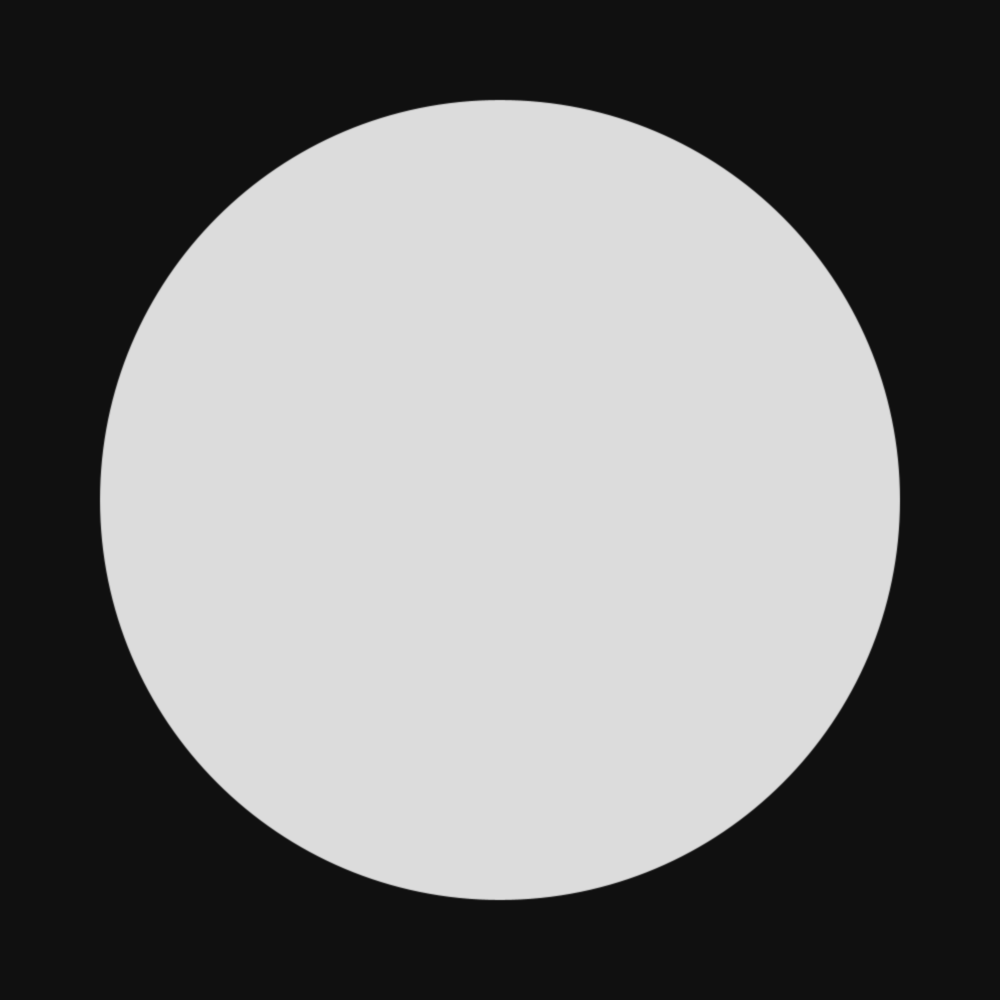
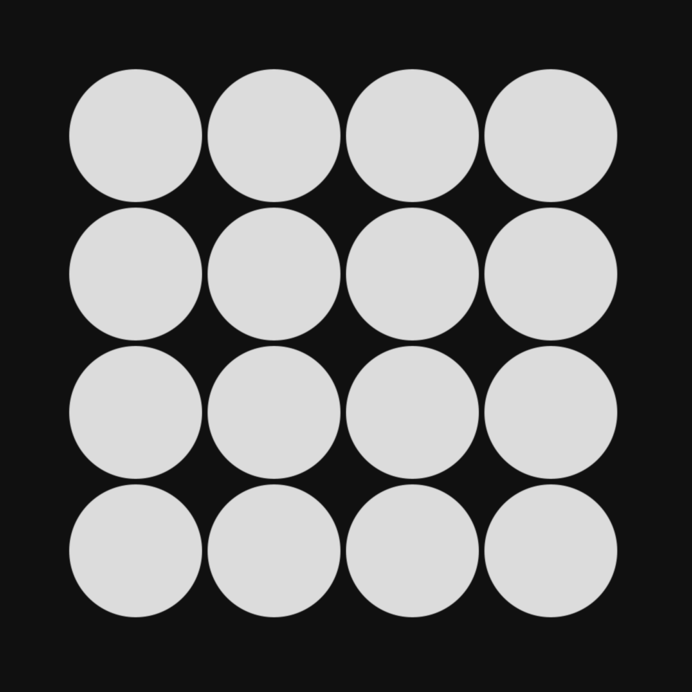
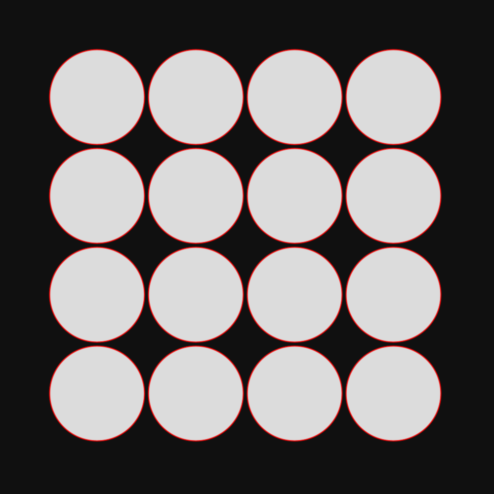
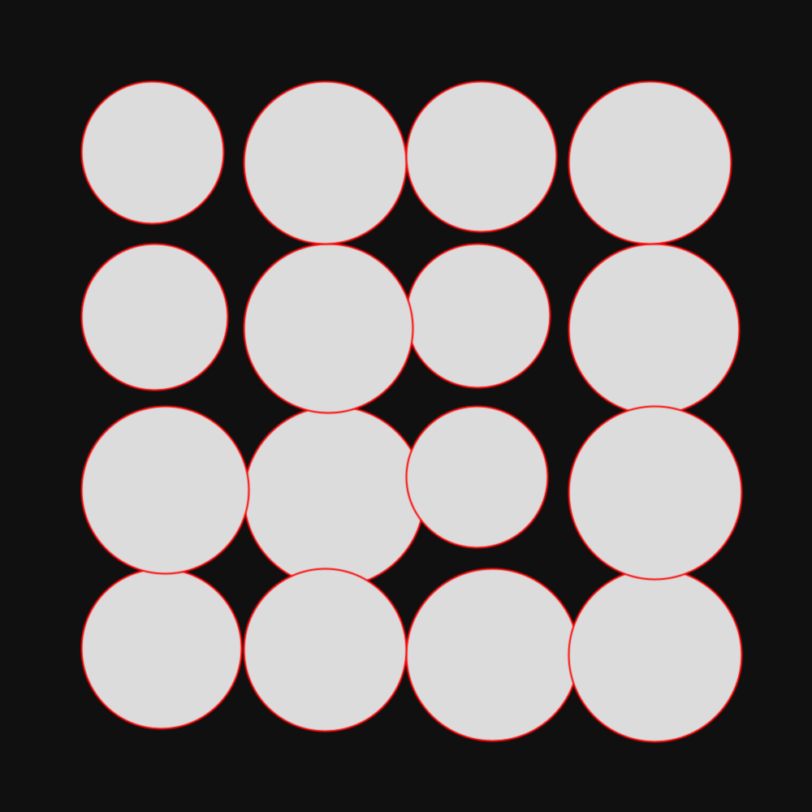
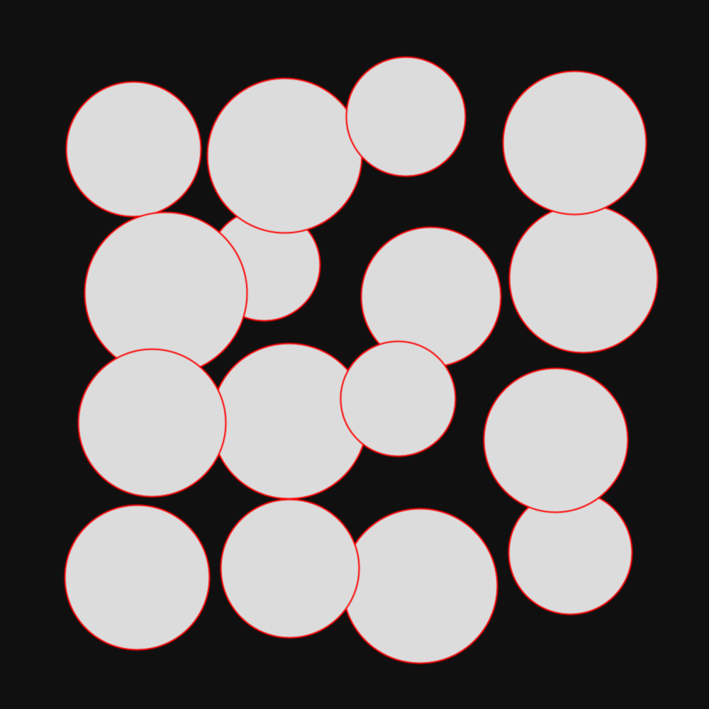
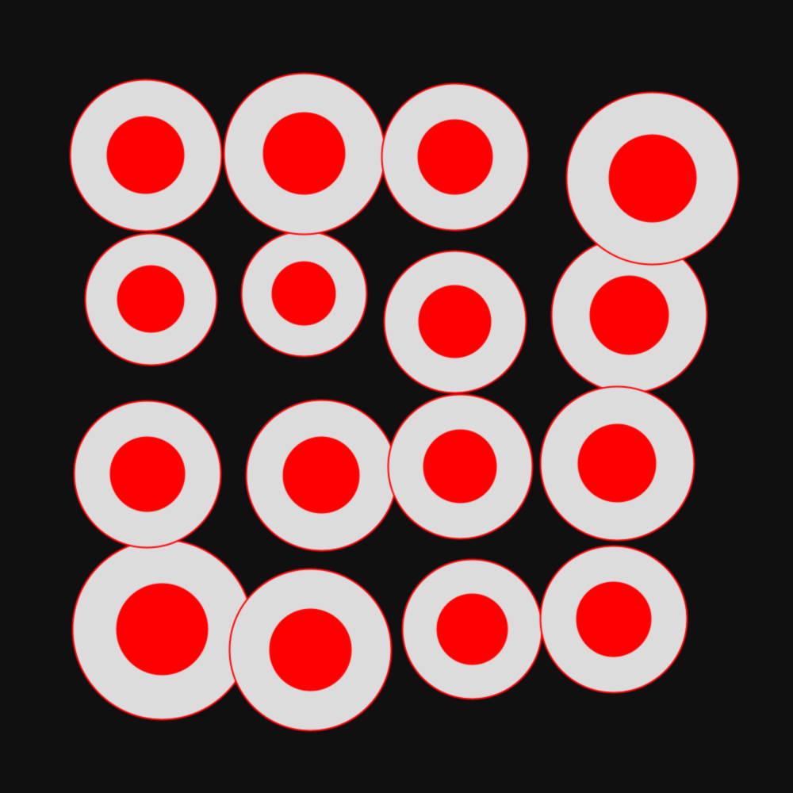
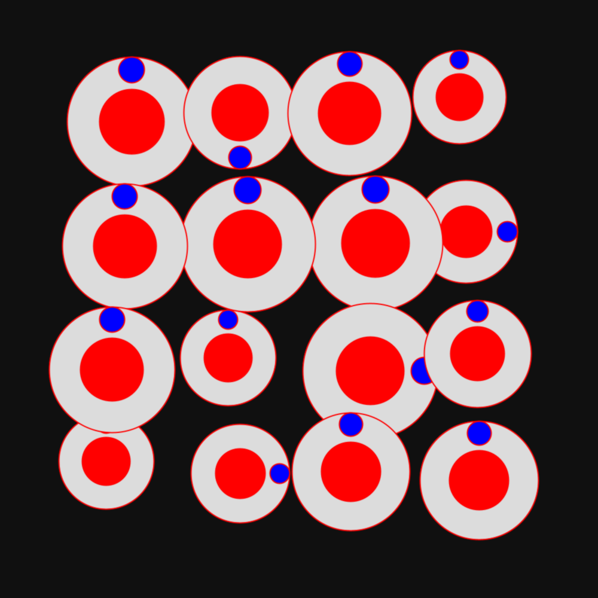
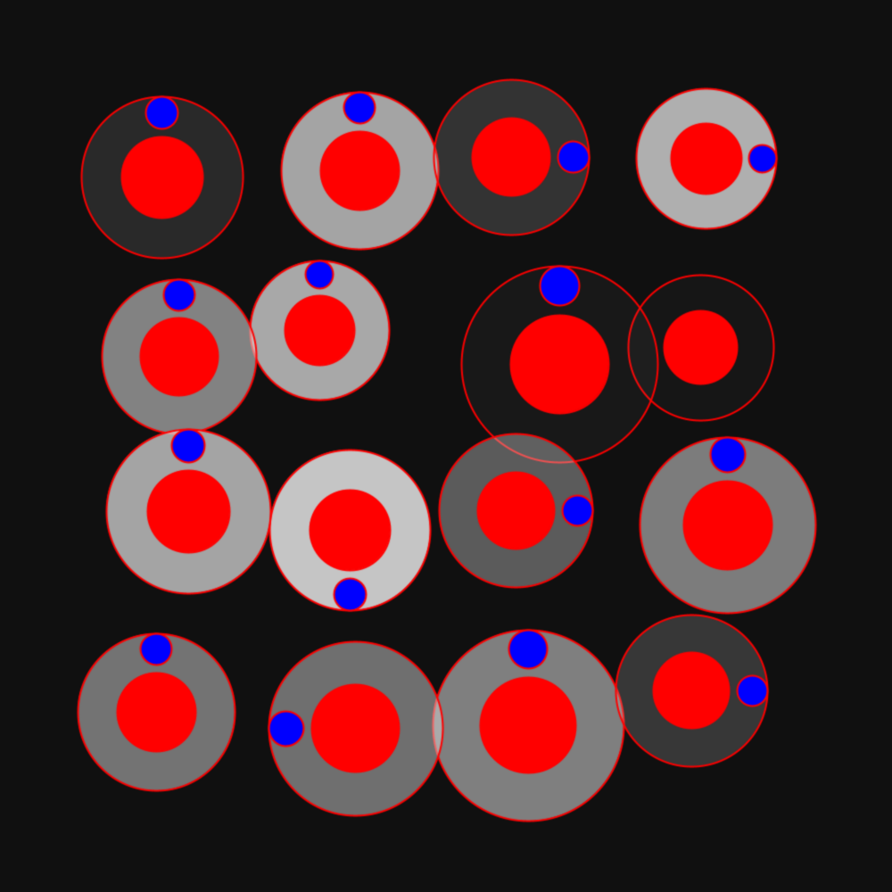

# Circle Examples

This page contains examples of features applied to circles. Each one applied on top of the previous one. 

The code for these examples is on [eu.pmav.pxp0p.frameconfiguration.impl.circle](../../src/main/java/eu/pmav/pxp0p/frameconfiguration/impl/circle). 

## 01 One circle

## 02 Multiple circles

## 03 Stroke

## 04 Size variation

## 05 Position variation

## 06 Center object

## 07 Cuts

## 08 Alpha

