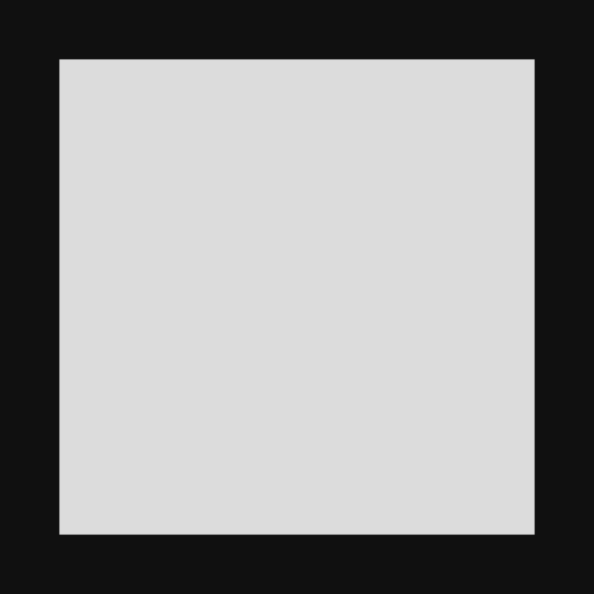
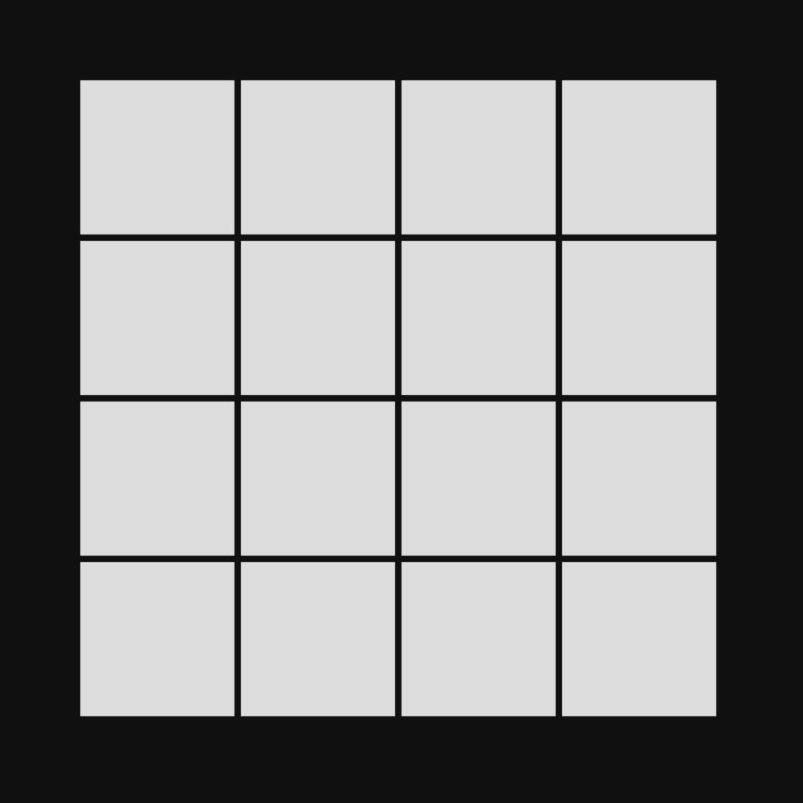
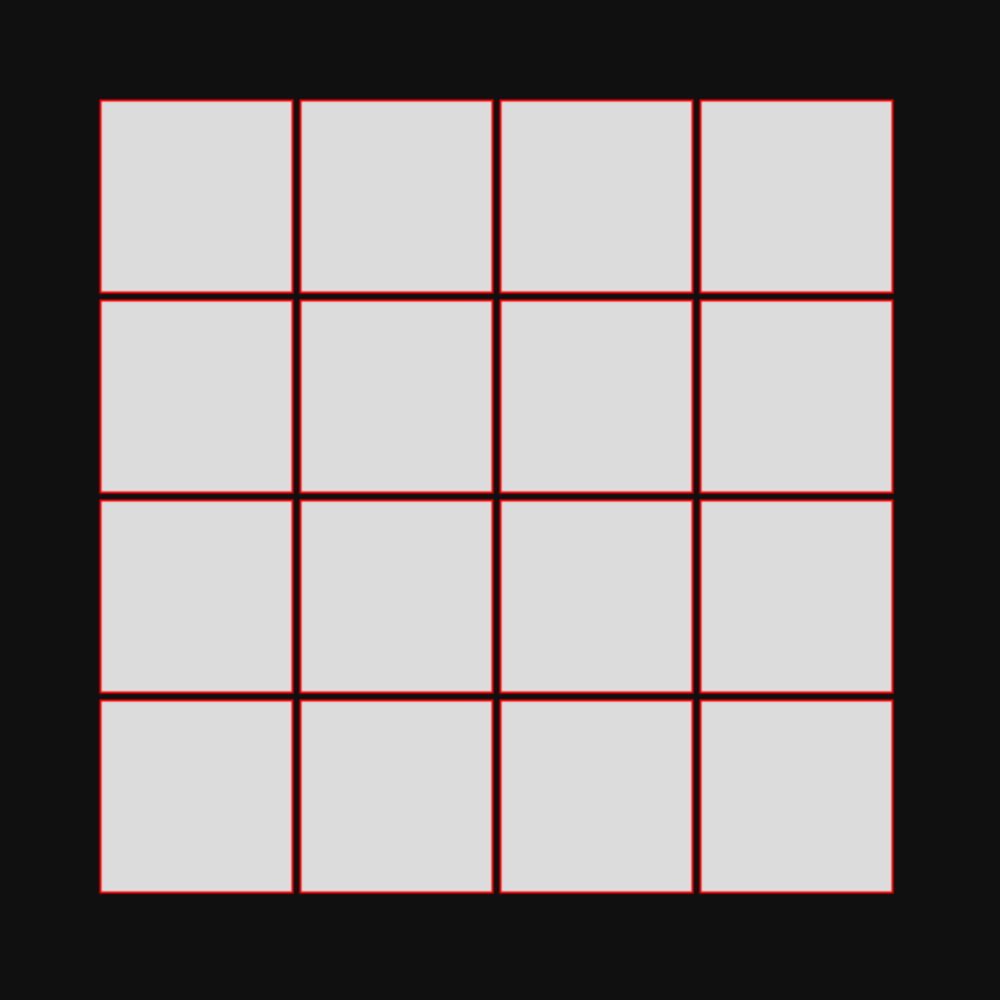
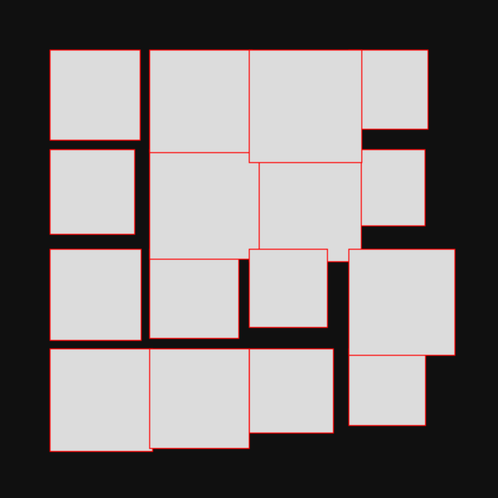
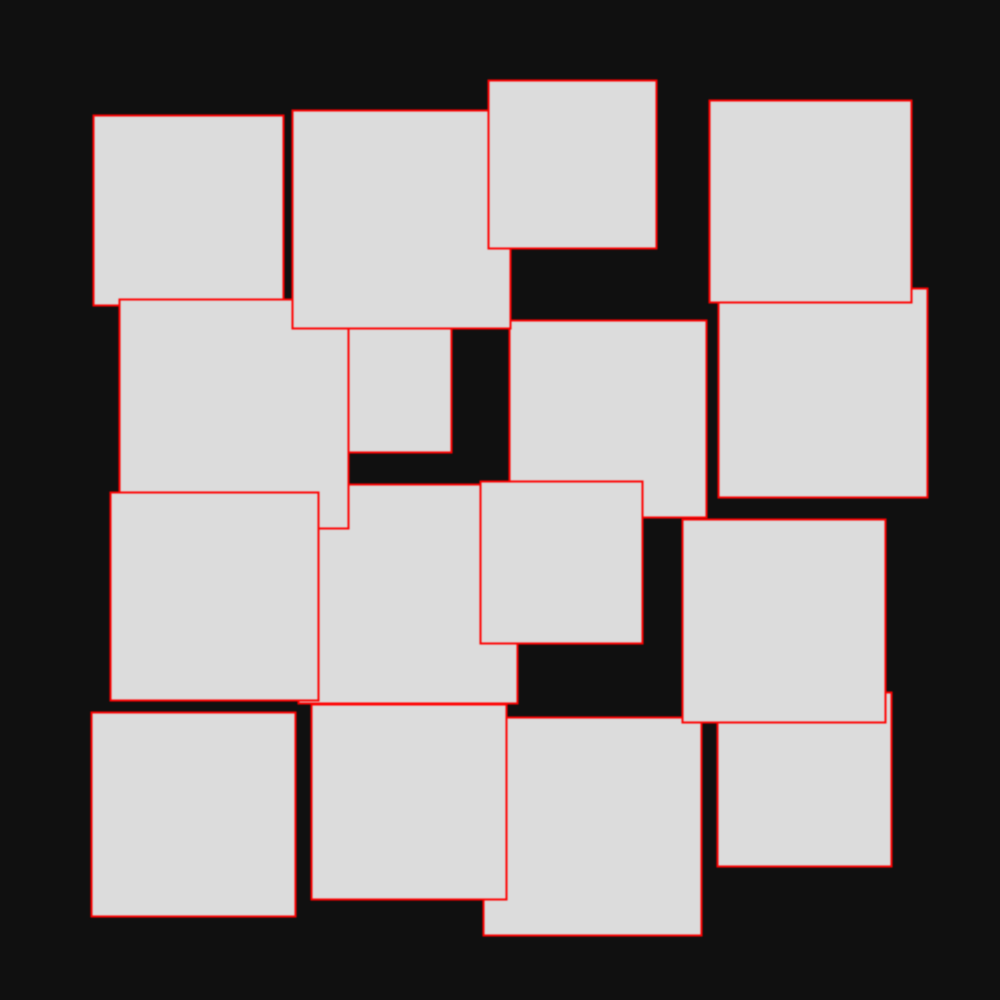
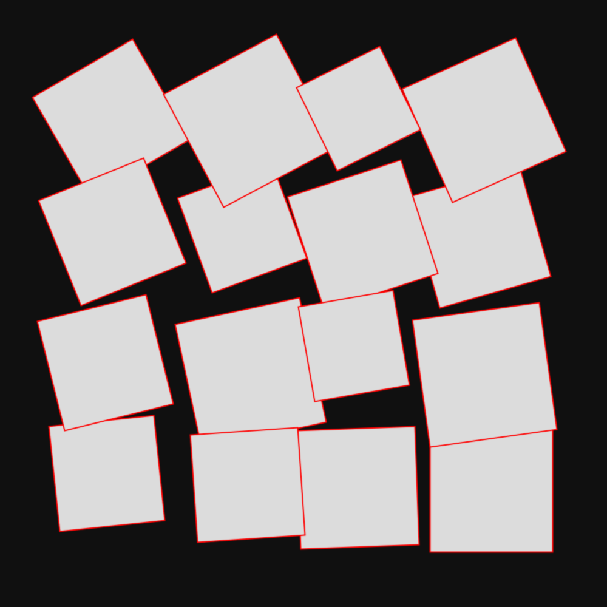
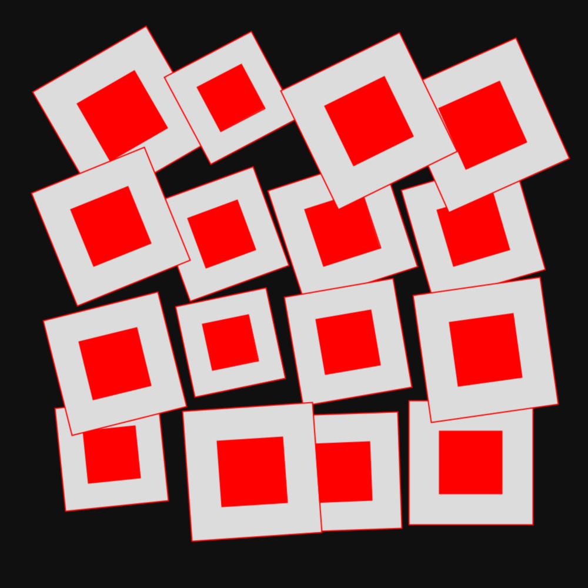
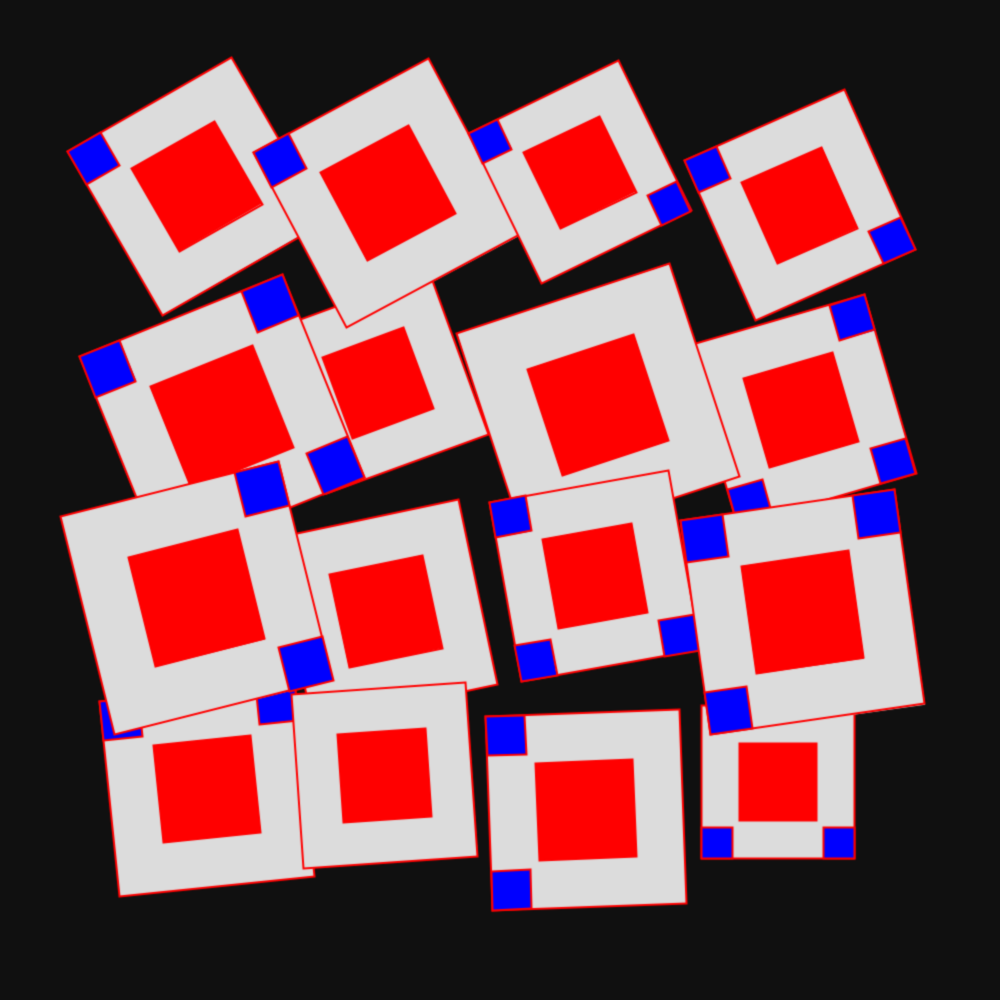
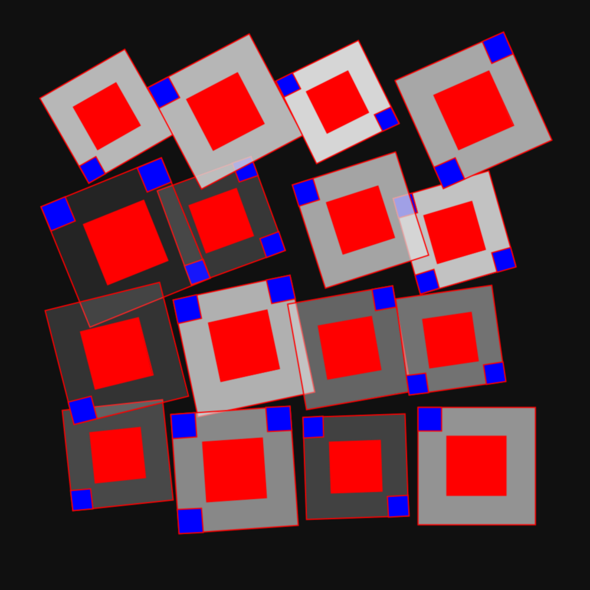

# Square Examples

This page contains examples of features applied to squares. Each one applied on top of the previous one. 

The code for these examples is on [eu.pmav.pxp0p.frameconfiguration.impl.examples.square](../../src/main/java/eu/pmav/pxp0p/frameconfiguration/impl/examples/square). 

## 01 One square

## 02 Multiple squares

## 03 Stroke

## 04 Size variation

## 05 Position variation

## 06 Rotation

## 07 Center object

## 08 Cuts

## 09 Alpha

